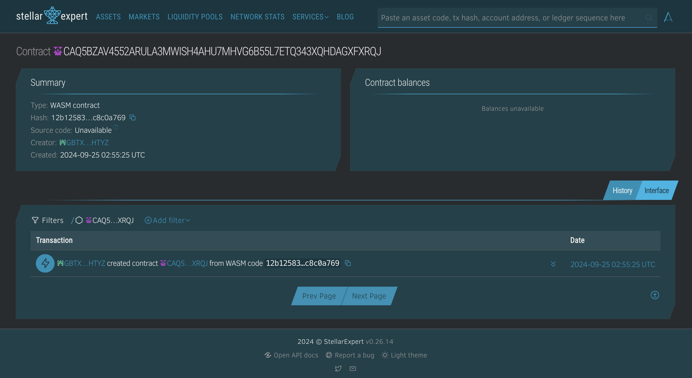

##### Deployed smartcontract address: CAD2GNF3AJAOOJDNQIWZRCX6NFLABUP7V5BMROL43GLLJLOP6CALBTXJ

# Decentralized Streaming Platform

## Project Title
**Decentralized Streaming Platform**

## Project Description
The Decentralized Streaming Platform is designed to allow content creators to stream video and audio content, while ensuring they are compensated directly through smart contracts on the Stellar blockchain. The platform leverages blockchain technology to handle payments, royalty distributions, and content access controls in a transparent and automated manner, removing the need for intermediaries and ensuring creators receive fair compensation for their work.

## Project Vision
The vision for the Decentralized Streaming Platform is to empower content creators by providing them with direct control over their revenue streams, ensuring transparency and fairness in payments and royalties. By using the Stellar blockchain, the platform promotes decentralized, secure, and efficient streaming services, where creators and consumers can interact without reliance on traditional gatekeepers. We aim to revolutionize the streaming industry by offering an alternative model that prioritizes creators’ rights and streamlines payment processes.

## Key Features
- **Direct Payments to Creators:** Content creators are compensated instantly through smart contracts, ensuring they receive payments as soon as their content is accessed or purchased.
- **Royalty Management:** Royalties are distributed automatically to creators based on content consumption, ensuring fair and transparent compensation.
- **Content Access Control:** Smart contracts manage content access, allowing users to stream video or audio only after meeting payment or subscription criteria.
- **Decentralized Infrastructure:** The platform is built on the Stellar blockchain, providing decentralized and transparent operations without the need for a central authority.
- **Low Transaction Fees:** Stellar’s low transaction costs ensure that creators keep more of their earnings while maintaining affordable access for users.
- **Seamless User Experience:** Consumers can access content easily with streamlined payments and smooth streaming without interruptions.

